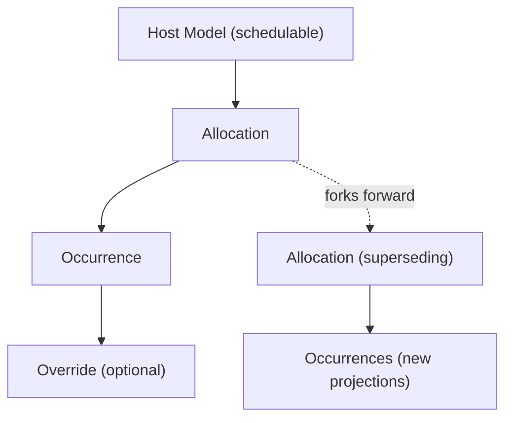

WhittakerTech::Aeon
====================
*4+1 Architecture document (vNext — upgraded)*

---

> **WhittakerTech::Aeon** is the temporal authority responsible for projecting
> immutable temporal laws into materialized occurrences while preserving historical
> integrity through forward-only timeline forking.

---

## Logical View (The System's Vocabulary)

This is where we define the nouns that must remain stable.

### Core Entities

#### Allocation (formerly “EventSpec”)

The immutable **temporal law** attached to a host record (the *schedulable*).

**Properties**
- append-only (never edited in-place)
- supersedable (forked forward; prior records remain)
- polymorphic attachment reference (`schedulable_type`, `schedulable_id`)
- declared temporal shape (`temporal_kind`)
- temporal definition (prototype) via:
  - anchor (`starts_at`)
  - optional duration (`duration_seconds`)
  - optional recurrence (`rrule`)
  - optional timezone (`timezone`)
- validity window (`valid_from`, `valid_to`)
- projection boundary (`projected_until`) — monotonic frontier
- occurrence retention policy override (optional)
- optional `attachment_version_ref` (opaque string; interpreted elsewhere)

> **Allocations** are never mutated. Fork instead. Always.

##### Temporal Shape (Declared, not inferred)

Allocation rows are self-describing; avoid “interpretive rows”.

| `temporal_kind` | Anchor | Duration | RRULE |
|---|---:|---:|---:|
| `instant`   | ✅ | ❌ | ❌ |
| `span`      | ✅ | ✅ | ❌ |
| `schedule`  | ✅ | ✅/❌ (allowed) | ✅ |

Notes:
- `schedule` may represent instant-like recurring triggers (duration optional).
- All validation of “does this *mean* anything” belongs to the host domain.

---

#### Occurrence

A **materialized prediction** projected from an Allocation (usually by a worker).

**Properties**
- fully self-describing, query-first
  - `time_range` (`tstzrange`) as canonical span
  - `starts_at`, `ends_at` derived (optional convenience)
- immutable coordinates once “historical”
- stateful overlay allowed (canceled, etc.)
- projection lineage metadata:
  - `projection_fingerprint` (hash of the Allocation inputs used to project)
  - `projected_at` (when this row was created)
- invalidation support for forks:
  - `invalidated_at` (soft-retired prediction)
  - `invalidated_by_allocation_id` (who superseded it)
- optional disposal support:
  - `purged_at` (set by disposal worker) OR hard delete (policy-driven)

> **Allowed Mutation:** state + invalidation metadata only. Never rewrite coordinates.

---

#### Override

A surgical deviation from projected reality (a layer on top of an occurrence).

**Use ONLY for:**
- change-this-event
- cancellation
- one-off move (reschedule a single instance)
- single-instance duration adjustment (if supported)

**Properties**
- belongs to a single occurrence (or uniquely identified by allocation + starts_at)
- can replace the effective time_range OR cancel the instance
- always wins over the base occurrence during reads

> **Do not fork allocations for single-instance edits.** This protects the system from spec explosion.

---

#### Projection Boundary

The monotonic frontier of known time stored on `Allocation#projected_until`.
- moves forward only
- never decreases
- projection is incremental and horizon-bounded

Time should feel inevitable inside **Aeon**.

---

#### Disposal Policy

Occurrences are materialized artifacts. Retention is policy-driven.

- **Global default**: `Aeon.config.occurrence_retention_policy`
- **Per-allocation override**: `Allocation#occurrence_retention_policy`

Example policy modes (minimal set; extensible):
- `:ephemeral` — delete/mark-for-purge aggressively (fast cache)
- `:windowed` — keep invalidated rows for N days, then purge
- `:historical` — keep indefinitely, purge only manually
- `:permanent` — never purge automatically

> Default globally, override locally. Governance prevents both hoarding and chaos.

---

### Relationships



No shortcuts. Shortcuts create future rewrites.

---

## Development View (How We Build It)

Keep **WhittakerTech::Aeon** boring internally. Boring engines scale.

Suggested Structure:

```
WhittakerTech::Aeon
  Allocation (model)          # immutable temporal law
  Occurrence (model)          # materialized projection
  Override (model)            # single-instance deviation

  Projector (service)         # expands IceCube -> upserts occurrences
  Forker (service)            # handles “change all / change future” semantics
  OverrideApplier (service)   # creates overrides safely
  Disposer (service)          # policy-driven purge / invalidation cleanup

  Schedulable (concern)       # ActiveStorage-like attachment DSL
```

### Models

#### Allocation (ActiveRecord)

Key columns (conceptual):
- `id` (uuid)
- `schedulable_type`, `schedulable_id` (polymorphic)
- `temporal_kind` (enum: instant/span/schedule)
- `starts_at` (timestamptz)
- `duration_seconds` (int, nullable)
- `timezone` (string, nullable; required for schedule)
- `rrule` (text/json, nullable; required for schedule)
- `valid_from`, `valid_to` (timestamptz; valid_to nullable)
- `projected_until` (timestamptz)
- `supersedes_allocation_id` (uuid, nullable)  # lineage
- `occurrence_retention_policy` (string/enum, nullable) # overrides global
- `attachment_version_ref` (string, nullable; opaque)

Recommended indexes:
- `(schedulable_type, schedulable_id, valid_from)`
- `(schedulable_type, schedulable_id)` partial where `valid_to IS NULL` (fast “active allocation” lookups)
- `(valid_from, valid_to)` (optional)

---

#### Occurrence (ActiveRecord)

Key columns:
- `allocation_id` (uuid, FK)
- `time_range` (tstzrange)  # canonical
- `starts_at`, `ends_at` (optional convenience; redundant but ergonomic)
- `state` (enum: active/canceled/etc.)
- `projection_fingerprint` (string)
- `projected_at` (timestamptz)
- `invalidated_at` (timestamptz, nullable)
- `invalidated_by_allocation_id` (uuid, nullable)
- `purged_at` (timestamptz, nullable) OR hard delete later

Recommended indexes:
- GiST on `time_range`
- B-tree on `(allocation_id, starts_at)`
- partial index for active rows: `WHERE invalidated_at IS NULL AND purged_at IS NULL`
- optional `(invalidated_at)` for disposal sweeps

Uniqueness / identity:
- Prefer unique constraint: `(allocation_id, starts_at)`
  - supports idempotent projection
  - enables “composite identity” even if a surrogate `id` exists

---

#### Override (ActiveRecord)

Key columns:
- `occurrence_id` (FK) OR `(allocation_id, starts_at)` (choose one strategy early)
- `replacement_time_range` (tstzrange, nullable)
- `canceled` (bool)
- `notes` / metadata (optional)
- auditing fields belong outside Aeon unless lightweight is required

Uniqueness:
- One override per occurrence (or per allocation+starts_at)

---

### Internal Services

#### Projector

Responsible for **IceCube expansion → DB upsert**.

**Goals**
- Stateless if possible
- Always idempotent
- Demand-driven horizon extension (never infinite projection)
- Produces occurrences for an allocation from `projected_until` → `target_until`

**Inputs**
- `allocation_id`
- `target_until` (e.g., query window end + buffer)

**Core behavior**
- expand schedule using IceCube anchored at allocation’s `starts_at`, `timezone`, `rrule`
- generate candidate starts (and ends via duration if present)
- upsert occurrences with `(allocation_id, starts_at)` uniqueness
- stamp `projection_fingerprint` derived from allocation’s recurrence definition
- advance `Allocation#projected_until` monotonically (transactionally)

> Let Postgres do range overlap queries; Aeon’s job is producing rows, not scanning time with Ruby.

---

#### Forker

Encapsulates timeline splitting logic (“Change All” / “Change Future”).

**Responsibilities**
- compute pivot time
- close prior allocation validity: `valid_to = pivot`
- create new allocation with `valid_from = pivot`, supersedes linkage
- invalidate prior projected future occurrences (policy-driven)
- optionally trigger projection for the new allocation

**Key invariant**
- No history rewritten
- Prior predictions become invalidated, not silently altered

> Forking is a force. Give it one home.

---

#### OverrideApplier

Creates overrides safely.

**Responsibilities**
- locate the target occurrence (or allocate+starts_at identity)
- create override row (cancel or replacement_time_range)
- never triggers projection regeneration
- enforces “one override per occurrence” uniqueness

---

#### Disposer

Policy-driven purge/cleanup for occurrences.

**Responsibilities**
- honor global default + per-allocation override
- delete or mark occurrences as `purged_at` based on policy
- optionally keep invalidated rows for a configurable window (forensics window)
- run as a low-priority background process to avoid DB churn

> Occurrences are artifacts. Governance prevents bloat without losing explainability.

---

### Schedulable (Concern + DSL)

Behaves like `has_one_attached`, but for temporal law (Allocation).

```ruby
class Lesson < ActiveRecord::Base
  include WhittakerTech::Aeon::Schedulable

  schedule :time_slot, dependent: :destroy
end
```

This produces:

```ruby
has_one :time_slot,
        as: :schedulable,
        class_name: "WhittakerTech::Aeon::Allocation",
        dependent: :destroy # overridable, default :nullify

has_many :time_slot_occurrences,
         through: :time_slot,
         source: :occurrences
```

Schedulable provides explicit verbs (no “helpful” magic):
- `override_occurrence(starts_at:, ...)`  # change-this-event
- `fork_future(pivot:, ...)`             # change-future
- `fork_all(...)`                        # change-all (rare; usually edit the “root” allocation)
- `ensure_projected!(window:)`           # request projection extension (async)

Blind temporal mutations are intercepted:
- host updates that affect temporal fields must **fork**, never edit in-place

---

### Configuration (minimal surface)

```ruby
WhittakerTech::Aeon.configure do |c|
  # projection
  c.projection_buffer = 14.days
  c.max_projection_window = 1.year

  # retention
  c.occurrence_retention_policy = :windowed
  c.invalidated_retention_window = 60.days

  # background execution
  c.queue_adapter = :sidekiq # or :inline/:active_job
end
```

---

### Explicit Non-Responsibilities

**WhittakerTech::Aeon** is not responsible for:
- snapshotting host data
- validating domain semantics
- managing lifecycle deletion of hosts
- performing audit logging / version diffs
- reconstructing versions / meaning

Those belong to the Host and/or adjacent engines (e.g., Clio).

> Purity is power.

---

## Process View (Runtime Behavior)

### Projection Flow (Demand-driven, non-blocking)

1. Query arrives requesting a time window.
2. Aeon loads relevant allocations for the schedulable whose validity overlaps the window.
3. Aeon checks whether each allocation’s `projected_until` covers `window_end + buffer`.
4. If insufficient → enqueue projection (do not block the request).
5. Return known occurrences immediately (may be partial).
6. Worker extends projection frontier calmly.

> **Never block reads on projection.** Protect the hot path.

---

### Blind Mutation Flow (Change Future / Change All)

Host changes temporal definition (rule/start/duration/timezone).

Aeon executes (via Schedulable):
```ruby
fork_future(pivot:)
```

Steps:
- old allocation closes (`valid_to = pivot`)
- new allocation begins (`valid_from = pivot`, `supersedes_allocation_id = old.id`)
- old future occurrences are invalidated:
  - `invalidated_at = now`
  - `invalidated_by_allocation_id = new.id`
- new allocation is queued for projection

> Projection continues forward. No history rewritten.

---

### Override Flow (Change This Event)

User edits one instance:
- create an override targeting that occurrence (or allocation+starts_at)
- never regenerates projections
- reads layer override on top of occurrence

> Overrides are surgical. Forking is structural.

---

### Disposal Flow (Policy-driven)

A disposer job runs periodically:
- selects occurrences eligible for purge based on:
  - invalidated status
  - age
  - allocation policy override or global default
- purges gently (batch deletes or sets `purged_at`)
- never touches historical rows that policy protects

> Storage discipline belongs to policy, not ad-hoc deletion.

---

## Physical View (Storage + Infrastructure)

**WhittakerTech::Aeon** is database-sensitive by nature.

Lean into Postgres — it is exceptional at temporal data.

### Occurrences Table

- Store canonical span as `tstzrange` (`time_range`)
- Index with GiST
- Prefer set-based SQL operations for invalidation/purge

> Your future self will be grateful during calendar-scale queries.

### Hard Constraints Worth Adding Early

**Allocation constraints**
- no overlapping active validity windows for the same schedulable:
  - enforce in app logic + optional exclusion constraint (advanced)
- `projected_until` monotonic:
  - update guarded by SQL check or app-level compare+lock

**Occurrence constraints**
- unique `(allocation_id, starts_at)`
- forbid coordinate updates once historical:
  - app-level guardrail + optional DB trigger if you ever need hard enforcement

**Override constraints**
- unique per occurrence (or allocation+starts_at)

> Constraints are silent guardians. Let the database enforce physics.

### Worker Topology

- one projector job type is enough
- do not prematurely shard
- scale through:
  - bounded horizons
  - indexes
  - set-based updates
  - idempotent upserts

Schedulers scale better through data discipline than worker fleets.

---

## Scenario View (Where Architecture Proves Itself)

### Scenario: “Change All Future Events”
- fork at pivot
- close original allocation validity window
- invalidate old future occurrences (do not rewrite)
- project forward for the new allocation

Result:
- no recomputation panic
- calendars stop showing false predictions
- (optional) invalidated rows retained briefly for explainability

---

### Scenario: “Change This Event”
- create override for occurrence (or allocation+starts_at)
- optionally mark occurrence state as canceled if override is cancellation
- reads layer override without touching projections

---

### Scenario: Projection Gap Under Load
- client requests window beyond `projected_until`
- Aeon returns partial known occurrences immediately
- projection job enqueued
- subsequent request returns complete window once projected

---

### Scenario: Host Deletes Record (Lifecycle Engine)
Aeon does nothing destructive.
- allocations may be nullified or destroyed depending on `schedule dependent:`
- occurrences remain historically valid unless disposal policy purges them

Composition happens above Aeon.

---

### Scenario: Forensic Reconstruction (Clio)
Occurrence → Allocation → attachment_version_ref
Clio resolves versions / meaning.
Aeon stays uninvolved.

---

## Anti-Goals (Forbidden Territory)

Aeon explicitly refuses the following responsibilities.
These are not future features — they are intentional exclusions.

### Aeon is NOT a Calendar System
Aeon provides temporal facts, not presentation.
It does not:
- render calendar views
- generate UI payloads (FullCalendar-specific JSON)
- manage display concerns (titles, colors, labels)
- localize human-readable dates

Aeon answers:
> “When does it occur?”

Never:
> “How should it look?”

---

### Aeon is NOT a Job Runner
Aeon materializes time. It does not execute business work.
It must never:
- enqueue domain callbacks
- orchestrate workflows
- trigger side effects based on meaning

Facts do not cause behavior. Observers do.

---

### Aeon is NOT an Audit Engine
Aeon preserves temporal structure, not semantic history.
It does not:
- snapshot host records
- store attribute diffs
- reconstruct business state

Aeon remembers *when*, not *what*.

---

### Aeon is NOT a Lifecycle Manager
Aeon does not decide whether a host record should exist.
It must never:
- soft-delete attachments
- enforce domain retention policies for hosts
- cascade destructive operations beyond its own records

Lifecycle authority belongs elsewhere (e.g., Oscar).

---

### Aeon is NOT a Version Resolver
Aeon may store opaque version references,
but it must never:
- query PaperTrail directly
- assume a versioning library
- enforce version contracts

Resolution is observational work (Clio or the host domain).

---

### Aeon is NOT a Domain Validator
Aeon enforces temporal physics, not business rules.
It does not:
- enforce capacity constraints
- prevent domain-specific conflicts
- decide what schedules are allowed

Hosts define meaning. Aeon defines possibility.

---

### Aeon is NOT Mutation-Friendly
Aeon refuses convenience edits that rewrite time.
It must never:
- update allocations in place
- recompute historical occurrences
- silently reinterpret the past

When time changes, Aeon forks forward. Always.

---

### Aeon is NOT Responsible for Perfect Foresight
Aeon does not materialize infinite futures.
It must not:
- attempt unbounded projection
- block reads awaiting projection
- treat projection gaps as failures

Projection is incremental. Time unfolds. Aeon unfolds with it.

---

## Guiding Principle

When uncertainty arises, default to:

> **“Does this concern define time — or merely describe what happens within it?”**

If it does not define time, it does not belong in **WhittakerTech::Aeon**.