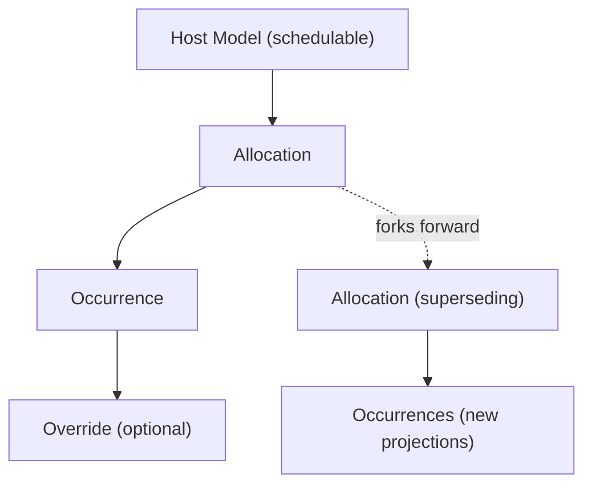

# Architecture

Aeon follows a 4+1 architectural model. This page covers the consumer-relevant portions.

## Entity Relationships

A host model owns an Allocation. The Projector materializes Occurrences from that Allocation. Overrides layer on top of individual Occurrences. When a schedule changes, Aeon forks — creating a successor Allocation linked by `supersedes_allocation_id`.

## Process Flows

### Projection

1. A query arrives requesting a time window
2. Aeon loads allocations whose validity overlaps the window
3. If `projected_until` doesn't cover the window, projection is enqueued
4. Known occurrences are returned immediately (may be partial)
5. The Projector extends the frontier: lock allocation, expand IceCube rules, upsert occurrences, advance `projected_until`

Reads are never blocked on projection. Partial results are returned while projection catches up.

### Forking

1. The host calls `fork_future(pivot:, ...)` or `fork_all(...)`
2. The Forker locks the old allocation (`FOR UPDATE NOWAIT`)
3. The old allocation is closed: `valid_to = pivot`
4. A successor allocation is created with lineage (`supersedes_allocation_id`)
5. Future occurrences from the old allocation are invalidated via set-based SQL
6. The successor is projected inline for the configured buffer

No history is rewritten. Prior predictions become invalidated, not silently altered.

### Override

1. The host calls `override_occurrence(starts_at:, ...)`
2. The OverrideApplier locates the target occurrence
3. An Override row is created (cancel or replacement time range)
4. No projections are regenerated

Overrides are surgical. Forking is structural.

## Database Design

All Aeon tables live in a dedicated PostgreSQL schema: `wt_aeon`.

### Tables

| Table | Purpose |
|---|---|
| `wt_aeon.allocations` | Immutable temporal laws with polymorphic attachment |
| `wt_aeon.occurrences` | Materialized predictions with tstzrange and GiST index |
| `wt_aeon.overrides` | Surgical single-instance deviations |

### Key Indexes

| Index | Type | Purpose |
|---|---|---|
| `time_range` on occurrences | GiST | Efficient temporal range queries via `&&` operator |
| `(allocation_id, starts_at)` on occurrences | Unique | Idempotent projection (INSERT ON CONFLICT DO NOTHING) |
| Active occurrences partial index | B-tree | Fast lookup of non-invalidated, non-purged rows |
| Active allocations partial index | Unique | One active allocation per schedulable (`valid_to IS NULL`) |

### Design Choices

- **UUID primary keys everywhere** — all IDs, FKs, and polymorphic references are UUIDs
- **`tstzrange` as canonical span** — PostgreSQL's native range type enables GiST indexing and `&&` overlap queries
- **`timestamptz` for all timestamps** — UTC everywhere, no timezone ambiguity
- **Schema format `:sql`** — `structure.sql` faithfully captures PG schema, GiST indexes, partial indexes, and tstzrange columns that `schema.rb` cannot represent
- **Dedicated PG schema** — `wt_aeon` isolates engine tables from the host application

## Internal Services

| Service | Responsibility |
|---|---|
| `Projector` | IceCube expansion into upserted occurrence rows |
| `Forker` | Forward-only timeline forking (close + create + invalidate + project) |
| `OverrideApplier` | Surgical single-occurrence override creation |
| `Disposer` | Policy-driven purge of invalidated occurrences (scaffolded, not yet implemented) |
