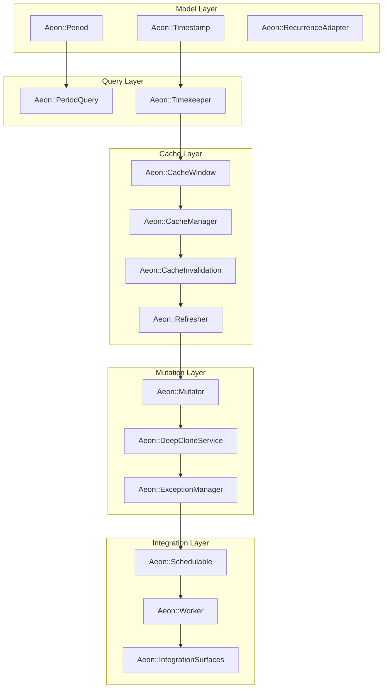

# 🕰️ Aeon Architecture Index – 4 + 1 Series

> *Aeon orchestrates temporal logic across the WhittakerTech ecosystem.*  
> Each subsystem below defines its own 4 + 1 architecture — focusing on one facet of time: persistence, recurrence, caching, mutation, or orchestration.

---

## 📚 Table of Contents

| File | Title | Summary |
|------|--------|----------|
| [AEON_PERIOD.md](AEON_PERIOD.md) | **Period & Time Arithmetic** | Core math layer — defines shift, grow, scale, and period operators. |
| [AEON_TIMESTAMP.md](AEON_TIMESTAMP.md) | **Timestamps & Persistence** | Polymorphic schedule persistence for host models. |
| [AEON_RECURRENCE.md](AEON_RECURRENCE.md) | **Recurrence Adapter** | Bridges Aeon JSON rules and IceCube schedules. |
| [AEON_TIMEKEEPER.md](AEON_TIMEKEEPER.md) | **Querying & Temporal DSL** | Public API for querying events and ranges. |
| [AEON_CACHEWINDOW.md](AEON_CACHEWINDOW.md) | **Cache Windows** | Expands query ranges with temporal buffers. |
| [AEON_CACHEMANAGER.md](AEON_CACHEMANAGER.md) | **Cache Management** | Handles Redis storage, memoization, and invalidation. |
| [AEON_CACHEINVALIDATION.md](AEON_CACHEINVALIDATION.md) | **Cache Invalidation Rules** | Refreshes caches when timestamps mutate. |
| [AEON_REFRESHER.md](AEON_REFRESHER.md) | **Dynamic Refresh Service** | Periodic background prewarming and recalculation. |
| [AEON_MUTATOR.md](AEON_MUTATOR.md) | **Mutation Semantics** | Defines “Change This / All / Future” behaviors. |
| [AEON_DEEPCLONE.md](AEON_DEEPCLONE.md) | **Deep Cloning Service** | Clones timestamps and attached records safely. |
| [AEON_EXCEPTIONMANAGER.md](AEON_EXCEPTIONMANAGER.md) | **Recurrence Exceptions** | Handles inclusion/exclusion rules for recurring events. |
| [AEON_SCHEDULABLE.md](AEON_SCHEDULABLE.md) | **Model Concern & DSL** | Adds `has_one_schedule :symbol` for host models. |
| [AEON_WORKER.md](AEON_WORKER.md) | **Legacy Worker Bridge** | Sidekiq/Redis orchestration compatibility. |
| [AEON_INTEGRATION_NOTES.md](AEON_INTEGRATION_NOTES.md) | **Integration Surfaces** | Defines Aeon’s adapter contracts and engine I/O sockets. |

---

## 🧩 Aeon Layer Map

---

## 🧠 Development Guidelines

1. **Isolation:**  
   Each component’s 4 + 1 doc should stand alone and integrate through defined adapters.
2. **Consistency:**  
   Every document includes:
  - Logical View
  - Process View
  - Development View
  - Physical View
  - Scenarios (+ Security & Observability if relevant)
3. **Language:**  
   Concise technical English with Aeon’s humanistic tone — calm, timeless, and precise.
4. **Schema Fragments:**  
   Use minimal code fences for model and service definitions.
5. **Cross-References:**  
   Use explicit links between 4 + 1 docs to illustrate engine interaction.
6. **Integration Philosophy:**  
   Aeon exposes *interfaces*, not *dependencies* — metrics, validation, and jobs are optional adapters injected via configuration.

---

## 🪞 Author’s Note

> *Aeon began as a clock.  
> It became a calendar.  
> Now it keeps the rhythm of creation —  
> a quiet pulse beneath every WhittakerTech system.*
>
> — *WhittakerTech Temporal Systems Architecture Team*

---